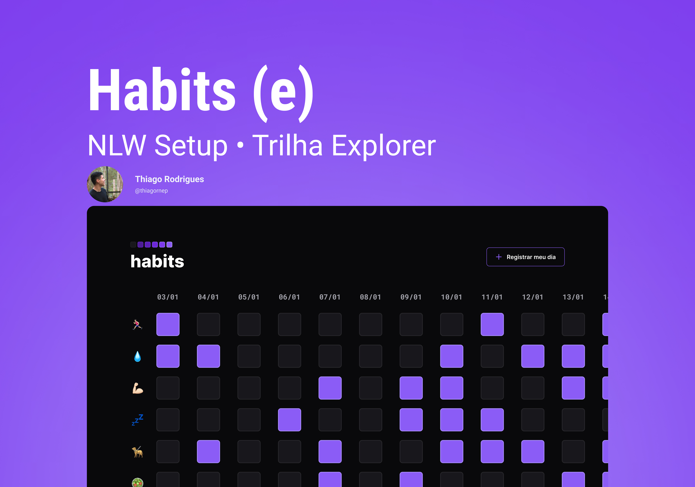

<h1 align="center"> Habits App </h1>
<h4 align="center">O Habits é um app para ajudar a rastrear os hábitos diários.</h4>

Programa exclusivo e gratuito promovido pela Rocketseat para ensino de tecnologias WEB.  

  <a href="#-tecnologias">Tecnologias</a>&nbsp;&nbsp;&nbsp;|&nbsp;&nbsp;&nbsp;
  <a href="#-projeto">Projeto</a>&nbsp;&nbsp;&nbsp;|&nbsp;&nbsp;&nbsp;
  <a href="#-layout">Layout</a>&nbsp;&nbsp;&nbsp;|&nbsp;&nbsp;&nbsp;
  <a href="#memo-licença">Licença</a>

  

 

## 🚀 Tecnologias

Esse projeto foi desenvolvido com as seguintes tecnologias:

- HTML e CSS
- JavaScript
- Git e Github
- Figma

## 💻 Projeto

O Habits é um app para ajudar a rastrear os hábitos diários.

- [Acesse o projeto finalizado, online](https://thiagornep.github.io/Devlink/)

## 🔖 Layout

Você pode visualizar o layout do projeto através [DESSE LINK](https://www.figma.com/file/Mlx09ZjkZKnVcY7qqTftuQ/Habits-(e)-(Community)?node-id=6%3A910&t=h19f89JLfI4VBkci-1). É necessário ter conta no [Figma](https://figma.com) para acessá-lo.

## 🚦 Licença

Esse projeto está sob a licença MIT.

---

Feito com ♥ by @thiagornep 
